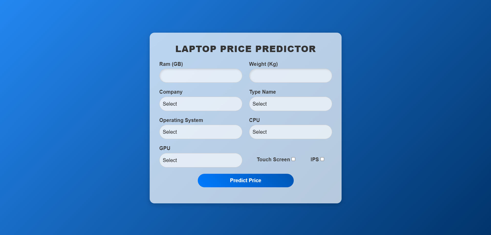

# Laptop Price Prediction System

## 📌 Project Overview
The **Laptop Price Prediction System** is a machine learning application that predicts laptop prices based on key specifications such as brand, processor, RAM, storage, and display features. It utilizes a trained model to provide price estimates for different laptop configurations.

## 🚀 Features
- 📊 **Data Preprocessing**: Cleans and prepares the dataset for training.
- 🤖 **Machine Learning Model**: Implements a regression model to predict laptop prices.
- 🎯 **Feature Engineering**: Extracts meaningful features to improve model performance.
- 📈 **Model Evaluation**: Assesses the model's accuracy and performance metrics.
- 🖥️ **Web Interface**: Provides a simple UI for users to enter laptop specs and get price predictions.

## 🏗️ Tech Stack
- **Programming Language**: Python 🐍
- **Machine Learning Libraries**: Scikit-learn, Pandas, NumPy, Matplotlib, Seaborn
- **Web Framework**: Flask
- **Data Storage**: CSV Dataset

## 📁 Project Structure
```
Laptop-Price-Prediction/
│── images/
│   ├── UI.png                     # UI screenshot
│── model_building/
│   ├── laptop_price.csv           # Dataset containing laptop specifications and prices
│   ├── model_building.ipynb       # Jupyter notebook for model training
│   ├── predictor.pickle           # Saved trained model
│── web_application/
│   ├── model/
│   │   ├── predictor.pickle       # Model used in the web app
│   ├── static/
│   │   ├── style.css              # CSS for styling the UI
│   ├── templates/
│   │   ├── index.html             # Web interface for user input
│── app.py                         # Flask web application
│── wsgi.py                        # WSGI entry point for deployment
│── .hintrc                        # Linter configuration file
│── README.md                      # Project documentation
│── requirements.txt                # Required dependencies

```

## 🛠️ Installation & Setup
### 1️⃣ Clone the Repository
```sh
git clone https://github.com/sudarshan-raveendranath/Laptop_Price_Predictor.git
cd web_application
```

### 2️⃣ Install Dependencies
```sh
pip install -r requirements.txt
```

### 3️⃣ Run the Application
```sh
python app.py
```
The application will run on **http://127.0.0.1:5000/**.

## 📊 Model Training
To train the model:
```sh
python model.py
```

## 📷 Screenshots


## 📌 Future Improvements
- Enhance the model with deep learning techniques.
- Expand the dataset for better accuracy.
- Deploy the application online using AWS or Heroku.

---
💡 *If you like this project, give it a ⭐ on GitHub!*

